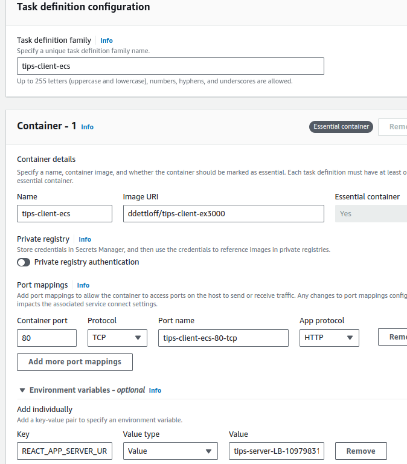
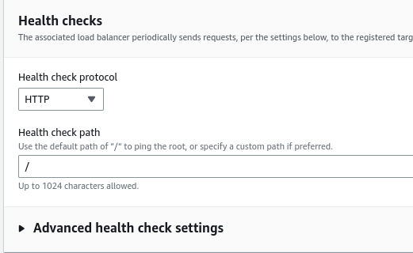
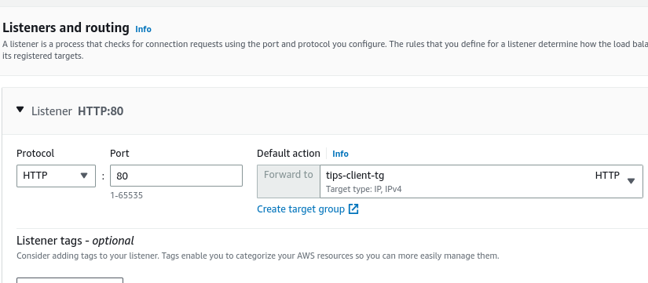
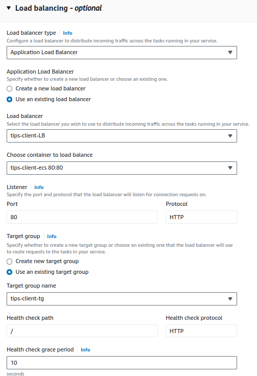

# Task Definition

This task definition is fairly straightforward, almost the same as the server.



* Server URL
Make sure this env variable points to the DNS of the load balancer the server service is using /api!

So if the DNS is 
`tips-server-LB-1097983176.us-east-1.elb.amazonaws.com`

This value for `REACT_APP_SERVER_URL` should be:
`tips-server-LB-1097983176.us-east-1.elb.amazonaws.com/api`

because in the app itself, `REACT_APP_SERVER_URL` is used preceding all of the routes.

Expose 80

See Dockerfile.prod, exposing 80 due to nginx:

```
FROM node:19-slim as build

WORKDIR /app

COPY package*.json ./

RUN npm install --legacy-peer-deps

COPY . .

RUN npm run build

FROM nginx:stable-alpine

COPY --from=build /app/build /usr/share/nginx/html

EXPOSE 80

CMD ["nginx", "-g", "daemon off;"]
```

# Load Balancer

A load balancer must point to the client service just like the server. 

The setup is almost exactly like the setup for the server load balancer.

### Security groups
The same security group for the server load balancer is fine here, as that simply exposes port 80 to the internet 0.0.0.0. This is the same setup we need here. 

### Target Groups

This can work just about exactly as the server setup. 

#### Client Health Check

This can go directly to `/` as this should return a 200 response automatically. 



Assign newly created target group and create the load balancer:



# Create Service

Very similar to server setup.

### Networking

Again, just make sure the VPC is the same as the cluster.
Also, choose the same security group as the server service. This security group accepts traffic from the load balancer security group, which both load balancers are using.


### Load balancing

Obviously choose the load balancer already created with the listener, target group, etc. that was created with it:



# Misc Notes

This was added to the prod dockerfile:

```
# Use build args to inject the environment variables
ARG REACT_APP_SERVER_URL

# Make sure the environment variables are set during the build stage
ENV REACT_APP_SERVER_URL=$REACT_APP_SERVER_URL
```
This is because the env variables need to be available during build time, not in the running container. The URL env variable is in the task definition just for documenting purposes at this time. It's also in the build-prod command, which is where this variable is actually provided. 
