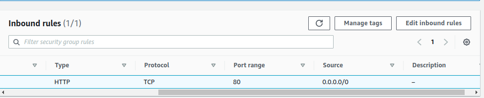
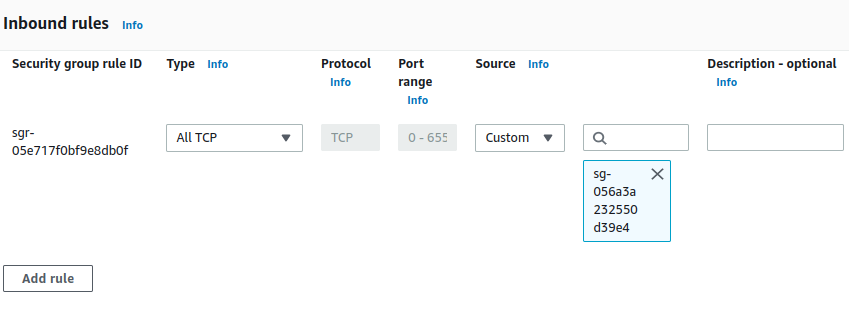
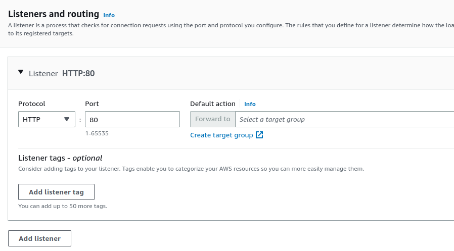
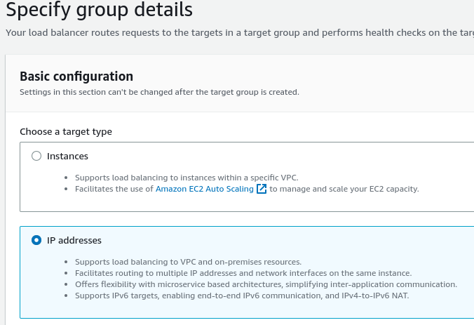
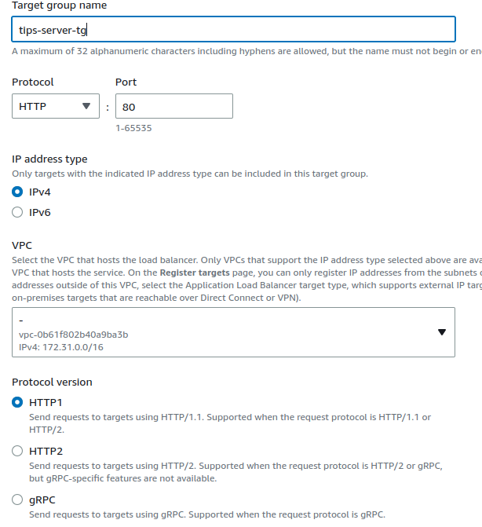
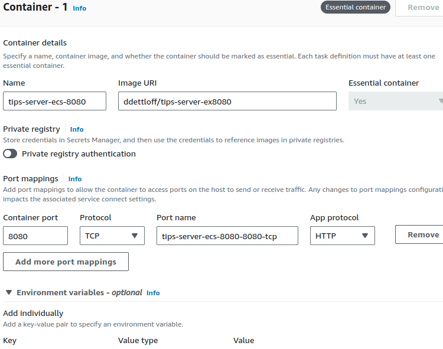
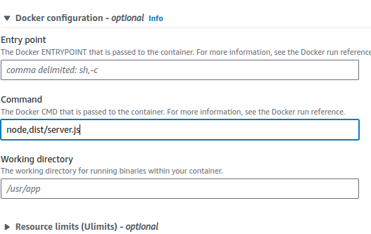
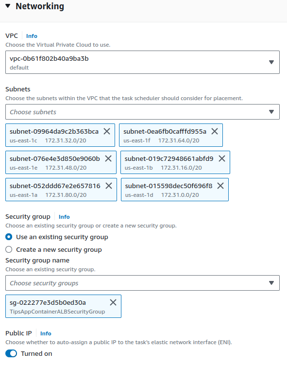
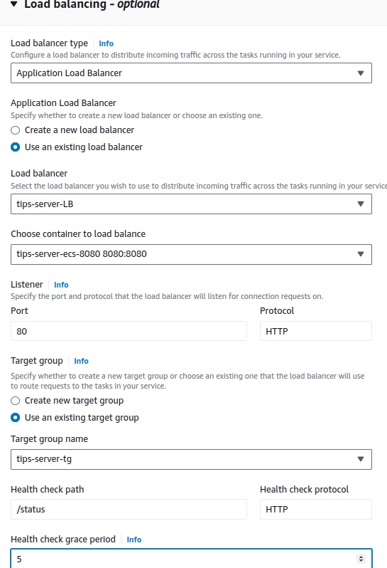
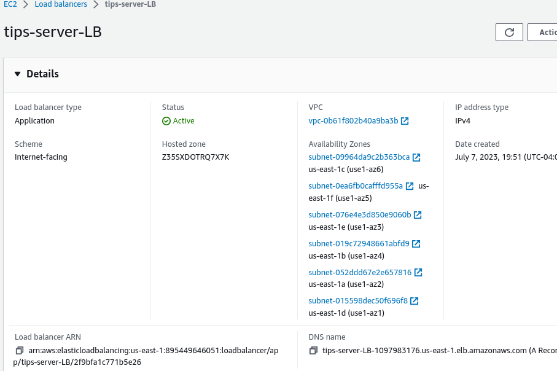

https://www.youtube.com/watch?v=rUgZNXKbsrY

This video was very helpful for all of this. 

# Set up Security Groups

Two securiy groups are setup for this - 

1. `TipsAppLoadBalancerSecurityGroup`

This security group is what the load balancer uses - it takes all traffic on port 80 from all of the internet. The load balancer is the 'entrypoint' into the application. The outbound rules don't need to change but inbound rules should be as follows:



2. `TipsAppContainerALBSecurityGroup`

This security group receives traffic from the load balancer. The load balancer is acting like a gatekeeper to the service. For the inbound rule, pick custom source and choose the security group of the load balancer that was made previously. 




# Create Load Balancer

* Make sure vpc is same as the cluster the service will be in.

### In listeners and routing, pick 80 - we then need to create a target group



* In target group, the second option of 'IP' must be chosen:



* Make name for the target group, choose port 80, and again make sure vpc is the same as the load balancer and the cluster.



### Health check

Make sure this goes somewhere in the application which will return a 200 response, otherwise the service will be shut down as it won't be considered 'healthy' without this. In `server.ts` I simply placed a `/status` route that returns 200 and OK:

```
app.get('/status', (req, res) => {
    res.status(200).send('OK');
  });
```

Or a little prettier :

```
app.get('/status', (req, res) => {
    return res.status(200).json({
        success: true,
        message: "OK"
    })
  });
```

### Register targets

Don't worry about this as this will be configured later; just click create.

### Back in the load balancer

Click refresh and select the target group which was just created.

# Task Definition

THIS is the ONLY place you put the desired port number if using something within the container that's not simply 80 (or 443 for https). This is creating a new revision because I updated the dockerfile but it's self explanatory.



Remember that here in docker config - if you need to specify the command do it here! (if needed to be different than what is specified in Dockerfile).

For instance, the Dockerfile uses `npm run server` but we don't want to use npm or `run server` which uses nodemon since that is for local testing. We want to directly use `node dist/server.js`. This can be avoided by having separate prod and dev Dockerfiles, or with this solution where the alternative command is specified like this:



# Create Service

* Go to the cluster and click create service

* This is pretty simple, just choose the task definition name from task definition family and make sure it says `LATEST` revision if you want the latest dockerfile changes.

## Networking

Under networking, choose the vpc again which matches up with the cluster, and under security group make sure to choose the one set up to listen for traffic from the load balancer:



## Load Balancer

Choose the application load balancer option and choose the one created in the previous step.



Use the existing target group that was made and the listener; this should all be on port 80. 

Health check grace period - not sure if it really matters but I added 5 - 10 seconds because why not?

# 4 Check If Running Via Load Balancer

You check the DNS of the load balancer to actually access the server since it's what is standing in between traffic from the world and the actual service running the server:




Check the server via the dns at the bottom right of the page. This can also be accessed by something like postman. Make sure you have `http` and not `https` unless actually using `https` or else it will appear to not be working. 